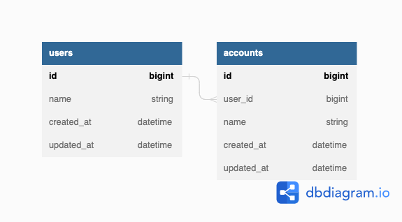
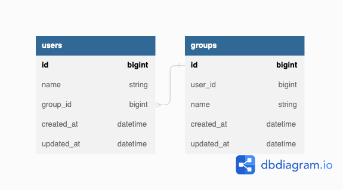
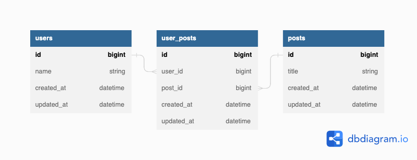

# Association

Queryx supports association definition in the schema file. It also generates corresponding preload query methods to avoid "N+1" query.

## belongs_to

```hcl
model "Post" {
  belongs_to "Author" {
    model_name = "User"
  }
}
```

::: tabs key:lang
== Go

```go
c.QueryPost().PreloadAuthor().All()
```

== TypeScript

```typescript
await c.queryPost().preloadAuthor().all();
```

:::

## has_one

```hcl
model "User" {
  has_one "account" {}

  column "name" {
    type = string
  }
}

model "Account" {
  belongs_to "user" {}

  column "name" {
    type = string
  }
}
```



::: tabs key:lang
== Go

```go
c.QueryUser().PreloadAccount().All()
c.QueryAccount().PreloadUser().All()
```

== TypeScript

```typescript
await c.queryUser().preloadAccount().All();
await c.queryAccount().preloadUser().All();
```

:::

## has_many

```hcl
model "User" {
  belongs_to "group" {}

  column "name" {
    type = string
  }
}

model "Group" {
  has_many "users" {}

  column "name" {
    type = string
  }
}
```



::: tabs key:lang
== Go

```go
c.QueryUser().PreloadGroup().All()
c.QueryGroup().PreloadUsers().All()
```

== TypeScript

```typescript
await c.queryUser().preloadGroup().all();
await c.queryGroup().preloadUsers().all();
```

:::

## has_many through

```hcl
model "User" {
  has_many "user_posts" {}
  has_many "posts" {
    through = "user_posts"
  }
}

model "Post" {
  has_many "user_posts" {}
  has_many "users" {
    through = "user_posts"
  }
}

model "UserPost" {
  belongs_to "user" {}
  belongs_to "post" {}
}
```



::: tabs key:lang
== Go

```go
c.QueryUser().PreloadPosts().All()
c.QueryPost().PreloadUsers().All()
```

== TypeScript

```typescript
await c.queryUser().preloadPosts().All();
await c.queryPost().preloadUsers().All();
```

:::
